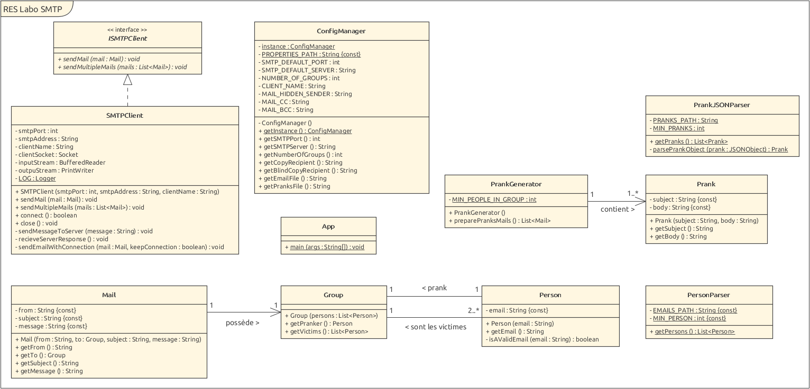
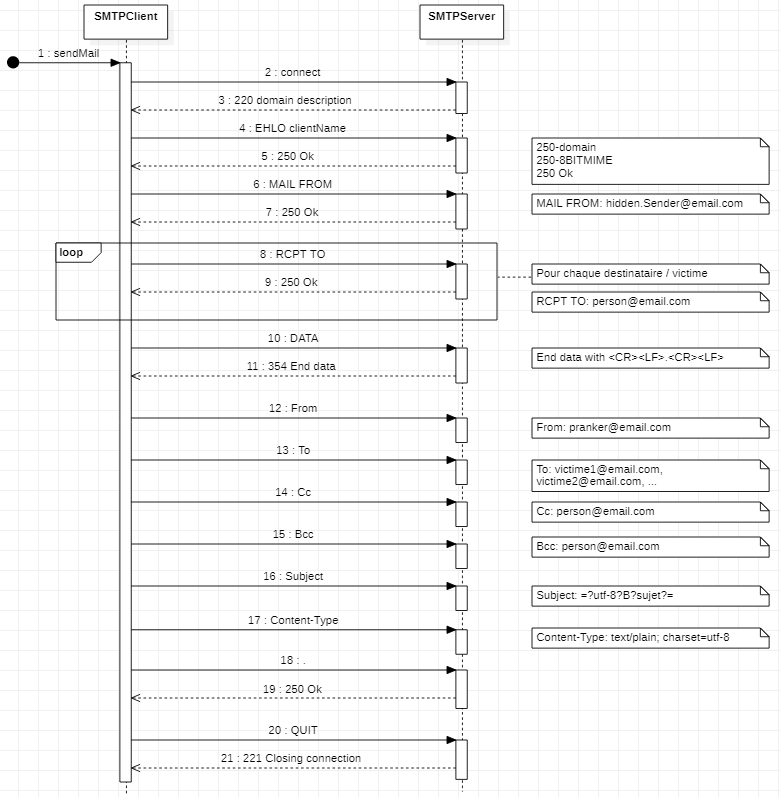

# RES - SMTP Pranks

> Par Alec Berney & Nicolas Crausaz

## Introduction

Ce laboratoire fait partie du cours RES de l'HEIG-VD. Il consiste en l'implémentation d'un logiciel d'envoi de "prank" par email.

Les objectifs de ce laboratoire sont de:
- Devenir familier avec le *protocole SMTP*, en travaillant avec les messages SMTP sans utiliser de librairies spécifiques pour SMTP.
- Utiliser des outils de test client-serveur, comme un "mock server".
- Créer et envoyer des _emails forgés_

## Fonctionnalités

Le fonctionnement de l'application se résume assez simplement:

Le programme réparti un certain nombre de personnes (adresses mail) dans un certain nombre de groupes (tout ceci est configurable).
Chaque groupe contient 1 "pranker" considéré comme l'expéditeur de l'email forgé, les autres membres du groupe seront considérés
comme les victimes, c’est-à-dire les destinataires du mail. Un groupe est donc au minimum composé de deux personnes.

Les pranks sont choisis aléatoirement parmi une liste personnalisable.


## Implémentation

Diagramme de classe (UML)



Nous allons maintenant expliquer les différents aspects / particularités de chaque classe (de gauche à droite)

### SMTPCLient
Cette classe permet d'envoyer les mails au serveur SMTP.
Sa particularité principale est qu'elle ne traite pas les codes erreurs reçu par le serveur.
Elle lit / consomme chaque réponse du serveur mais ne fait aucune gestion d'erreur.
Cependant, elle log toutes les réponses du serveur et ces propres envois, afin d'avoir un tracé de ce qui s'est passé.
Si une erreur est parvenue pendant l'envoi du mail, elle sera loggé au niveau "SEVERE" et l'email ne s'enverra pas.

### Mail
Cette classe modélise un mail qui devra être envoyer avec le SMTPClient.

### ConfigManager
Cette classe permet de récupérer les informations de configuration de l'application.
Elle vérifie également que ces dernières soient conforme au attentes.
Elle vérife aussi que les entrées obligatoire contiennent bien une donnée.
Nous avons décidé d'en faire un Singleton.

### App
Cette classe utilise simplement les autres classes afin de faire tourner le programme.

### Group
Cette classe modélise un groupe qui contient un "pranker" qui correspond au faux envoyeur du futur email.
Le groupe contient également une liste de "victimes" qui correspondent au receveur du futur email.

### PrankGenerator
Cette classe gère toutes la logique de l'application.
C'est-à-dire qu'elle créée les groupes avec le bon nombre de personnes.
Elle génère également les emails à partir des pranks.

### Person
Cette classe modélise une personne et plus précisément un email pour cette application.
Elle va être utilisée pour constituer les groupes.

### PrankJSONParser
Cette classe est un parser JSON utilisé afin de récupérer et générer les pranks présents dans le fichier pranks.json.

### Prank

### PersonParser

Voici un exemple d'une interation client-serveur du protocole SMTP.



Dans cet exemple, on envoie 1 seul mail à plusieurs destinataires, puis on ferme la connexion.
Il serait également possible d'envoyer plusieurs mails à la suite en envoyant une requête "RSET" après le ".".
Le serveur répondrait "250 OK" en cas de succès. Il serait ensuite possible de recréer tout le processus de puis la commande"EHLO clientName".

## Tests

Nous avons réalisé des tests unitaires pour presque toutes les classes créées. 
Les tests unitaires les plus poussés étant ceux du client SMTP, objectif principal du laboratoire.
Tous ces tests pouvant être executés; *attention*, certains tests envoient des emails (ceux du client SMTP).
Il vaut mieux donc utilisé le mock server pour effectuer les tests.

`$ mvn clean test`

## Améliorations possibles


## Configuration

Afin d'être prêt à envoyer vous pranks, vous allez d'abord devoir préparer quelques élèments.
Premièrement, remplissez le fichier d'adresses mails [fichier d'adresses mails](configs/emails.utf8) (configs/emails.utf8) avec tous les emails auquel vous souhaitez envoyer et recevoir des pranks.
Ensuite, remplissez le [fichier de pranks](configs/pranks.json) (configs/pranks.json) avec vos meilleures blagues, chaque prank doit avoir un titre (qui sera le sujet du mail) et un contenu (corps du mail).

Vous allez probablement devoir éditer la [configuration](configs/config.properties) (configs/config.properties) pour répondre à vos besoin:

```
SMTP_DEFAULT_PORT= <Port de votre serveur SMTP | Requis>
SMTP_DEFAULT_SERVER= <Adresse IP Port de votre serveur | Requis>
NUMBER_OF_GROUPS= <Nombre de groupes / mail qui seront envoyés | Requis>
CLIENT_NAME= <Nom de l'application | Requis>
MAIL_HIDDEN_SENDER= <Adresse mail cachée de l'expéditeur des pranks | Requis | Le format de l'email doit être valide>
MAIL_CC= <Adresse mail qui sera mise en copie de chaque prank | Optionnel>
MAIL_BCC= <Adresse mail qui sera mise en copie cachée de chaque prank | Optionnel>
```

Notez que les valeurs spécifiés par _Requis_ *doivent être spécifiées*, sinon l'application vous transmettra son mécontentement.

Si vous souhaitez tester l'application sans envoyer de vrai emails, nous avons mis à disposition un _mock server_ qui fera office de serveur SMTP.
Pour travailler avec ce serveur, modifiez les deux premiers champs du fichier de configuration de cette manière:

```
SMTP_DEFAULT_PORT=2525
SMTP_DEFAULT_SERVER=localhost
```

Ceci fait, vous allez pouvoir démarrer le container Docker du _mock server_:

Construire l'image:\
`$ ./docker/build.sh`

Démarrer le container:\
`$ ./docker/run.sh`

Tout est prêt, vous pouvez désormais commencer à envoyer vos pranks en exécutant:

`$ java -jar .\target\smtp-pranks-1.0-SNAPSHOT-launcher.jar`

Si vous avez utilisé notre serveur Mock, les mails sont visible sur [http://localhost:8080](http://localhost:8080).
